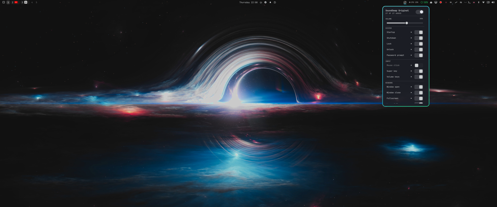

# SoundSwap

**System Sounds for Omarchy**

SoundSwap is a lightweight, customizable system sound manager for Omarchy Linux.
It includes the curated **SoundSwap Original** collection and lets you replace
any event sound with your own file. Its 27 events cover desktop, device, power,
notification, and Omarchy lifecycle actions.

## Install

Run this from a terminal inside your Omarchy desktop session. The installer
configures the Hyprland event hooks, bar widget, user services, Omarchy menu
shutdown, reboot, and logout actions, and bundled sounds. It needs no manual
systemd or Omarchy configuration and does not use `sudo`.

```bash
git clone https://github.com/tg5ee/soundswap.git
cd soundswap
./install.sh
```

Before changing installed files, the installer reports PASS, WARN, or FAIL for
required commands and the desktop session. It checks the user service manager,
audio playback commands (`pw-play`, `paplay`, or `mpv`), and active PipeWire or
PulseAudio services. A missing required dependency stops installation with a
repair hint; audio warnings allow installation to continue. It does not install
packages or change system-wide configuration.

The installer preserves existing settings and sound files and can be rerun to
update. Existing BeepBoop and older Omarchy Sounds installations are migrated
automatically. Run `soundswap doctor` to check the installation and
`soundswap status` to see settings and sound files. The widget can be opened
from the bar. Toggle shutdown audio in the widget or with
`soundswap enable shutdown` / `soundswap disable shutdown`.

## Uninstall

From the checkout, run `./uninstall.sh`. This removes SoundSwap's hooks, widget,
user services, and shutdown menu integration while preserving settings and
custom sound files. To remove the retained SoundSwap settings and working sound
copies too, run `./uninstall.sh --purge`; a backup is created first.

## Adding sounds

Put files in `~/.config/soundswap/sounds/` named after the event
(`.wav .ogg .oga .flac .mp3`). Missing files are simply silent.

| File name | Event | Plays when |
|---|---|---|
| **System** | | |
| `startup` | Startup | When you log in |
| `shutdown` | Shutdown | Shut down, reboot or log out |
| `lock` | Lock | The screen locks |
| `unlock` | Unlock | You unlock the screen |
| `auth-prompt` | Password prompt | An app asks for your password |
| **Input** | | |
| `click` | Mouse click | Any mouse button |
| `super` | Super key | Tapping Super on its own |
| `volume-keys` | Volume keys | Volume up, down or mute |
| **Windows** | | |
| `window-open` | Window open | A window opens |
| `window-close` | Window close | A window closes |
| `maximize` | Fullscreen | A window goes fullscreen or maximized |
| `restore` | Leave fullscreen | A window goes back to normal size |
| `workspace` | Workspace switch | You change workspace |
| `attention` | Needs attention | A window asks for attention |
| `menu-open` | Menu open | Omarchy menu or app launcher opens |
| `menu-close` | Menu close | Omarchy menu or app launcher closes |
| **Notifications** | | |
| `notification` | Notification | A normal notification arrives |
| `notification-critical` | Critical notification | Urgent alerts and errors |
| `screenshot` | Screenshot | A screenshot is saved |
| **Devices & power** | | |
| `device-connect` | Device connected | USB or Bluetooth device plugged in |
| `device-disconnect` | Device disconnected | USB or Bluetooth device removed |
| `charger-connect` | Charger plugged in | Power cable connected |
| `charger-disconnect` | Charger unplugged | Running on battery |
| `battery-low` | Low battery | Omarchy's 10% warning |
| `battery-critical` | Critical battery | Battery at or below 5% |
| **Omarchy** | | |
| `theme-change` | Theme changed | You switch Omarchy theme |
| `update-complete` | System Update | Packages and migrations finish; other update stages may follow |

Files in this repo's `sounds/` folder are the **SoundSwap Original** collection.
The installer keeps an original copy under `~/.local/share/soundswap/original/`
and seeds missing working files under `~/.config/soundswap/sounds/`. Replacing a
working file never modifies the original collection, and rerunning the installer
never overwrites an existing working file.

## Bar widget

The installer adds a **SoundSwap** widget to the right side of the bar, built
with the same panel kit as Omarchy's Audio and Bluetooth panels.

- **Left click**: open the panel. It has a master on/off switch, a volume slider,
  and one row per event with its own switch and ▶ preview button. Window open and
  window close are separate rows with separate files.
- **Right click**: turn all sounds on/off
- **Middle click**: open the sounds folder



Keyboard, with the panel open: arrows move, Enter toggles, ←/→ change volume,
`p` previews the selected sound, `s` turns everything on/off, `o` opens the folder.

Move it with `omarchy bar move soundswap.sounds --section left|center|right`.
From scripts: `omarchy-shell soundswap.sounds toggleSounds`.

The icon is a compact switching mark with opposing audio-wave arcs. It contains
no robot mascot or generic music-note decoration.

## Controlling it from the terminal

```bash
soundswap status           # what's on, which files are present
soundswap doctor           # read-only dependency and integration checks
soundswap off | on | toggle
soundswap disable click    # turn off one event
soundswap volume 0.4
soundswap event-volume click 0.5  # gain multiplied by master volume
soundswap test [event]
soundswap preview <event>  # plays even if that event is switched off
soundswap events           # list every event and its trigger
soundswap log [on|off]     # watch triggers live, for troubleshooting
```

Changes take effect immediately; no Hyprland reload needed.

`config.example` records the working installation's preferences: click and
critical notifications are disabled; master volume is 0.55. Low and critical
battery sounds are enabled. Debug logging is off in the example. The installer
preserves existing settings and uses `config.default` for a new installation.
Apply individual preferences with the CLI or panel; the example is not
installed automatically.

SoundSwap Original includes clips for all 27 events used by the working
installation. See
[`sounds/SOURCES.md`](sounds/SOURCES.md) for provenance and intentional reuse.

## How it works

| Source | Events |
|---|---|
| Hyprland Lua events (`hypr/soundswap.lua`) | startup, window open/close, fullscreen/restore, workspace, attention, menu open/close (`omarchy-menu` layer), password prompt (`omarchy-polkit` layer) |
| Non-consuming Hyprland binds (the key still does its job) | mouse clicks, volume keys, Super tap (release bind that only fires on a lone tap) |
| `soundswap-daemon` (`soundswap.service`) | lock/unlock (omarchy-shell's lock log in the user journal), notifications and screenshots (session D-Bus; normal ones respect Do Not Disturb), USB (udev) and Bluetooth (BlueZ) devices, charger and critical battery (UPower) |
| Omarchy hooks (`~/.config/omarchy/hooks/*.d/soundswap`) | battery-low, theme-set, post-update |
| Omarchy shutdown, reboot, and logout menu actions | Wait for `shutdown` playback (up to 24 seconds plus a one-second kill grace), then invoke Omarchy's original action even if audio fails. |
| `soundswap-shutdown.service` | Fallback `ExecStop` playback for lifecycle paths that bypass the menu. Skips a duplicate after successful menu playback and is ordered to stop before PipeWire, WirePlumber, or PulseAudio. |

Device sounds are skipped for 8 seconds after resuming from suspend and never
repeat within a second, so reconnect bursts don't machine-gun. Everything calls
`soundswap-play <event>`, which reads `~/.config/soundswap/config`.

The event list lives in `share/events.tsv`; the CLI and the bar panel both read
it, so adding an event there (plus whatever fires it) is all it takes.

### Troubleshooting

`soundswap doctor` reports PASS, WARN, or FAIL for runtime commands, audio,
Omarchy lifecycle helpers, plugin files and registration, the Hyprland loader,
and user services. It explains missing integrations and only reads system state;
FAIL exits nonzero, while WARN flags a limitation without failing the check.

`soundswap log on`, then `soundswap log` shows every trigger as it
happens, whether or not a sound file exists for it.

### Development checks

Run from the checkout; lifecycle tests use temporary homes and fake desktop and
audio commands, so they do not shut down or alter the active desktop:

```bash
python3 -m unittest discover -s tests -v
node tests/test_panel.js
lua tests/test_hypr.lua
luac -p hypr/soundswap.lua
shellcheck bin/* share/common.sh install.sh uninstall.sh hooks/*
git diff --check
```

These checks cover parsing, playback routing, watcher cleanup, UI state changes,
fresh installs, BeepBoop upgrades, and safe install/uninstall behavior. The
installer routes Omarchy's shutdown, reboot, and logout menu actions through
synchronous pre-playback; the shutdown service remains a fallback for other
lifecycle paths and is ordered to stop before the supported audio services.
Automated checks and preview commands cannot prove audibility through every
login, lock/unlock, reboot, logout, or shutdown path; those still need desktop
lifecycle testing.
